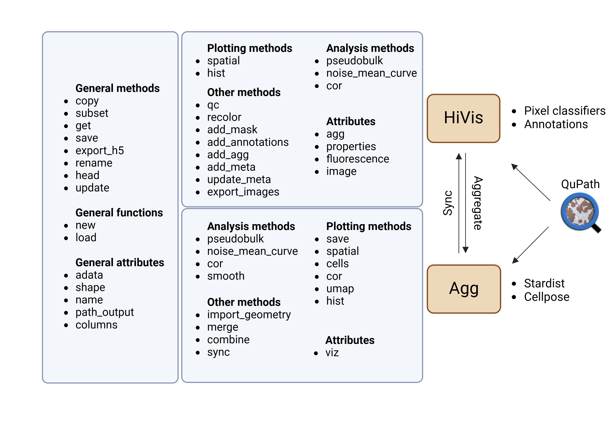

# HD Integrated Visium Interactive Suite (HiVis)
* **HiVis** is a user-friendly Python tool for analyzing  
  [10X VisiumHD](https://www.10xgenomics.com/products/spatial-gene-expression) data,  
  supporting both H&E and immunofluorescence experiments.
* **HiVis** is built on top of [AnnData](https://anndata.readthedocs.io/en/latest/), 
integrating seamlessly with other spatial transcriptomics tools such as
 [Scanpy](https://scanpy.readthedocs.io/en/stable/) and 
 [Squidpy](https://squidpy.readthedocs.io/en/stable/).  
* **HiVis** provides extensive data visualization with fully customizable plots. 
Plots are created using *matplotlib*, allowing stacking and further customization.  
* **HiVis** works with 
[QuPath](https://qupath.readthedocs.io/en/stable/)
to enable easy manual annotation, pixel classification, and single-cell segmentation using
 [Stardist](https://github.com/stardist/stardist/) and 
 [Cellpose](https://github.com/MouseLand/cellpose).
 It links bins and single-cell objects, facilitating seamless information exchange across levels.  



## Getting started
### Installation

To avoid dependency conflicts, we recommend the the use of a 
dedicated 
[conda](https://docs.conda.io/projects/conda/en/latest/user-guide/tasks/manage-environments.html) 
environment.  In a terminal run the command:

```bash
conda create -n HiVis python=3.11
conda activate HiVis
```

We recommend two options to then install HiVis in your virtual environment.

Use the package manager [pip](https://pip.pypa.io/en/stable/) to install HiVis. 
In a terminal run the command:

```bash
pip install HiVis
```

Or clone the project's [Github repository](https://github.com/roynov01/HiVis) 
and install it manually with the following commands:

```bash
git clone git@github.com:roynov01/HiVis.git
cd HiVis
pip install .
```

### Usage and Documentation
Please refer to the demo notebooks:
* [Full HiVis analysis]()
* [Fluorescence demo]()

For QuPath, please refer to the tutorials:
* [Pixel classification]()
* [Manual annotations]()
* [Cell segmentation]()


Function docstrings are available on [ReadTheDocs]().

## Contact
Bug report/feature request via the [GitHub issue tracker](https://github.com/roynov01/HiVis/issues).

## Citation

