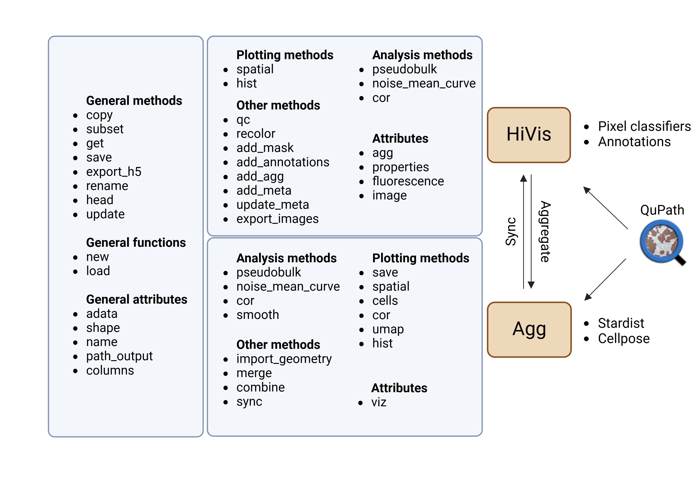

# HD Integrated Visium Interactive Suite (HiVis)
Project home page is available in [github](https://github.com/roynov01/HiVis)


## Installation

To avoid dependency conflicts, we recommend the use of a 
dedicated 
[conda](https://docs.conda.io/projects/conda/en/latest/user-guide/tasks/manage-environments.html) 
environment.  In a terminal run the command:

```bash
conda create -n HiVis python=3.12
conda activate HiVis
```

We recommend two options to then install HiVis in your virtual environment.

Use the package manager [pip](https://pypi.org/project/HiVis/) to install HiVis. 
In a terminal run the command:

```bash
pip install HiVis
```

Or clone the project's [Github repository](https://github.com/roynov01/HiVis) 
and install it manually with the following commands:

```bash
git clone git@github.com:roynov01/HiVis.git
cd HiVis
pip install .
```

To use Qupath features, such as manual annotations and pixel classifiers, download and install 
[QuPath](https://qupath.github.io/) (>= 0.5.1).

To perform cell segmentation in QuPath, download and install [Stardist](https://github.com/qupath/qupath-extension-stardist) 
and/or [Cellpose](https://github.com/BIOP/qupath-extension-cellpose) extensions for QuPath.


## Tutorials
Please refer to the demo notebooks:
* [Full HiVis analysis](https://github.com/roynov01/HiVis/blob/main/tutorials/HiVis_tutorial.ipynb)
* [Fluorescence demo](https://github.com/roynov01/HiVis/blob/main/tutorials/HiVis_fluorescence_tutorial.ipynb)

For QuPath, please refer to the tutorials:
* [Pixel classification]()
* [Manual annotations]()
* [Cell segmentation]()


## Contact
Bug report/feature request via the [GitHub issue tracker](https://github.com/roynov01/HiVis/issues).

## Citation

